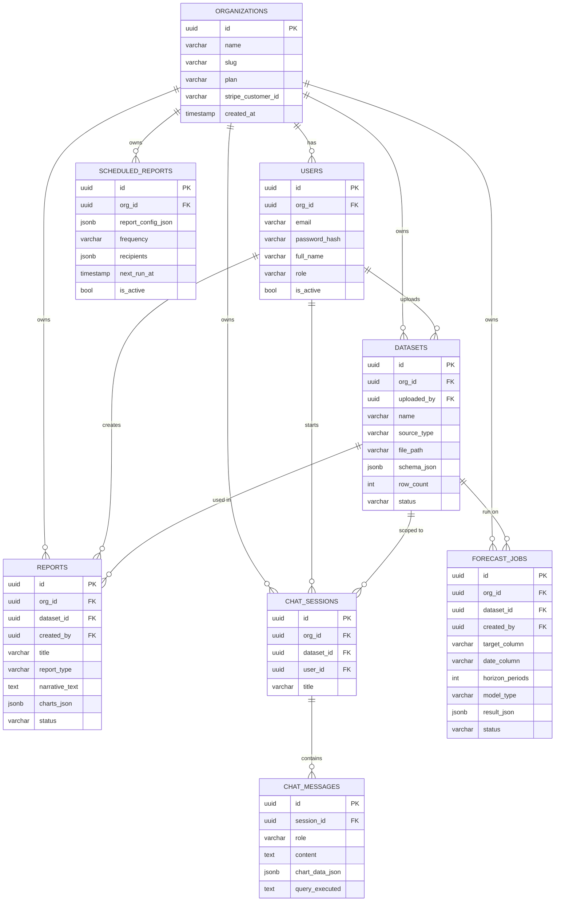

# Database Schema
## AI-Based Business Report Generation and Analytics System

PostgreSQL. All IDs are UUIDs. Every tenant-scoped table carries `org_id` — this is the multi-tenancy backbone; every query in the service layer must filter by it.

---

## 1. ER Diagram

---

## 2. Table Definitions

### `organizations`
| Column | Type | Notes |
|---|---|---|
| id | uuid PK | |
| name | varchar(255) | |
| slug | varchar(100) | unique, used in URLs |
| plan | enum(`free`,`starter`,`pro`,`enterprise`) | default `free` |
| stripe_customer_id | varchar(255) | nullable, post-MVP |
| created_at / updated_at | timestamptz | |

### `users`
| Column | Type | Notes |
|---|---|---|
| id | uuid PK | |
| org_id | uuid FK → organizations.id | indexed |
| email | varchar(255) | unique |
| password_hash | varchar(255) | bcrypt/argon2 |
| full_name | varchar(255) | |
| role | enum(`owner`,`admin`,`member`,`viewer`) | |
| is_active | bool | default true |
| created_at / updated_at | timestamptz | |

### `datasets`
| Column | Type | Notes |
|---|---|---|
| id | uuid PK | |
| org_id | uuid FK | indexed |
| uploaded_by | uuid FK → users.id | |
| name | varchar(255) | |
| source_type | enum(`csv`,`xlsx`) | MVP; add `postgres`, `mysql`, `gsheet` post-MVP |
| file_path | varchar(512) | S3 key |
| schema_json | jsonb | `[{column, inferred_type, nullable_pct}]` |
| row_count | int | |
| status | enum(`uploading`,`processing`,`ready`,`error`) | |
| error_message | text | nullable |
| created_at / updated_at | timestamptz | |

### `reports`
| Column | Type | Notes |
|---|---|---|
| id | uuid PK | |
| org_id | uuid FK | indexed |
| dataset_id | uuid FK → datasets.id | nullable if dataset later deleted (soft-preserve report) |
| created_by | uuid FK → users.id | |
| title | varchar(255) | |
| report_type | enum(`auto_summary`,`custom`,`scheduled`) | |
| narrative_text | text | LLM-authored narrative around computed stats |
| computed_stats_json | jsonb | the deterministic numbers the narrative is grounded in |
| charts_json | jsonb | chart configs + data |
| status | enum(`queued`,`generating`,`completed`,`failed`) | |
| created_at | timestamptz | |
| generated_at | timestamptz | nullable until complete |

### `chat_sessions`
| Column | Type | Notes |
|---|---|---|
| id | uuid PK | |
| org_id | uuid FK | indexed |
| dataset_id | uuid FK → datasets.id | |
| user_id | uuid FK → users.id | |
| title | varchar(255) | nullable, auto-set from first message |
| created_at | timestamptz | |

### `chat_messages`
| Column | Type | Notes |
|---|---|---|
| id | uuid PK | |
| session_id | uuid FK → chat_sessions.id | indexed |
| role | enum(`user`,`assistant`,`system`) | |
| content | text | |
| chart_data_json | jsonb | nullable |
| query_executed | text | the validated query that was run, shown to user for transparency |
| created_at | timestamptz | |

### `forecast_jobs`
| Column | Type | Notes |
|---|---|---|
| id | uuid PK | |
| org_id | uuid FK | indexed |
| dataset_id | uuid FK → datasets.id | |
| created_by | uuid FK → users.id | |
| target_column | varchar(255) | |
| date_column | varchar(255) | |
| horizon_periods | int | |
| model_type | enum(`prophet`,`ets`,`arima`) | |
| result_json | jsonb | forecast points + confidence intervals |
| status | enum(`queued`,`running`,`completed`,`failed`) | |
| created_at / completed_at | timestamptz | |

### `scheduled_reports` (post-MVP feature, model it now)
| Column | Type | Notes |
|---|---|---|
| id | uuid PK | |
| org_id | uuid FK | |
| report_config_json | jsonb | dataset_id + report_type + params |
| frequency | enum(`daily`,`weekly`,`monthly`) | |
| recipients | jsonb | array of emails |
| next_run_at | timestamptz | |
| is_active | bool | |

### `audit_logs` (recommended for a business tool handling client data)
| Column | Type | Notes |
|---|---|---|
| id | uuid PK | |
| org_id | uuid FK | |
| user_id | uuid FK | nullable (system actions) |
| action | varchar(100) | e.g. `dataset.uploaded`, `report.exported` |
| resource_type / resource_id | varchar / uuid | |
| metadata_json | jsonb | |
| created_at | timestamptz | |

---

## 3. Indexing Notes

- Composite index `(org_id, created_at DESC)` on `reports`, `datasets`, `chat_sessions` for fast dashboard listing.
- Unique index on `users.email`.
- Unique index on `organizations.slug`.
- `chat_messages(session_id, created_at)` for ordered message retrieval.

## 4. Migration Tool

Use **Alembic** for schema migrations from day one — do not let an AI coding agent hand-edit the database directly; every schema change should be a reviewed migration file.
